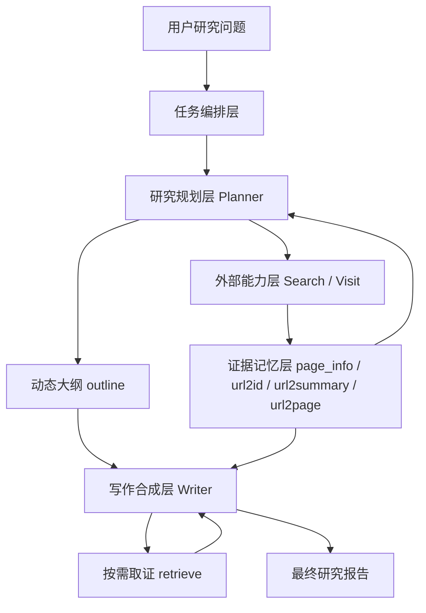

# Qwen DeepResearch 抽象架构教学

## 1. 这份文档教什么

这份文档不讲“某个函数怎么写”，也不讲“脚本怎么启动”。

它只回答一个更重要的问题：

**这个仓库在模块架构上，是如何把“开放式深度研究”组织成一个可控的 LLM 应用系统的？**

学习目标有三个：

1. 看清系统边界，而不是把整个仓库当成一个混杂的大工程。
2. 看清核心模块分工，而不是只盯着 ReAct 循环。
3. 看清控制对象和中间知识对象，理解系统为什么能从“搜索”走到“成文”。

---

## 2. 先建立全局视角

### 2.1 仓库不是单一系统，而是一个研究家族

`Qwen Deepresearch` 根目录同时包含几类东西：

- 根目录 `inference/`：通用 deep-research 风格的 ReAct 推理框架。
- 根目录 `evaluation/`：评测脚本。
- `WebAgent/`：信息搜寻 agent 家族。
- `Agent/`：更广义的 agent 研究方向。

所以从架构学习的角度，不应该把整个仓库理解成“一个应用”。

更准确的理解是：

**这是一个研究家族仓库，其中既有通用 agent 推理骨架，也有面向“深度研究报告生成”的专门架构。**

### 2.2 如果你的目标是学习“深度研究文档编排”，核心样本是 WebWeaver

在 `WebAgent` 家族里，最适合拿来学习“研究型应用编排”的模块是 `WebWeaver`。

原因很简单：

- 它不是单纯做问答。
- 它不是单纯做网页检索。
- 它明确把“研究”和“写作”拆成了两个阶段。
- 它显式维护中间知识对象，而不是只依赖聊天上下文。

所以如果学习目标是抽象架构，推荐把它看成这个仓库中的代表性“应用编排层设计样本”。

---

## 3. 先回答：这个系统到底在解决什么问题

普通 QA 系统解决的问题是：

**给一个问题，检索一些材料，然后生成一个答案。**

而 deep research 系统解决的问题是：

**给一个开放问题，持续探索相关信息，形成结构化研究框架，管理证据，并最终生成一篇长篇、可引用、结构稳定的研究文档。**

这两类问题在架构上完全不同。

因为 deep research 不是一次生成，而是至少包含四种不同认知活动：

1. 问题展开  
把模糊问题拆成可研究的子方向。

2. 信息探索  
搜索、筛选、访问、验证材料。

3. 结构收敛  
把探索结果组织成一个可演进的大纲。

4. 内容合成  
按照大纲，结合证据，分段写成报告。

这里最关键的第一性原理是：

**研究是发散过程，写作是收敛过程。**

因此，一个好的 deep research 架构，通常不会把两者粗暴混成一个单回路 agent。

---

## 4. 抽象架构总览

可以先把 `WebWeaver` 理解成一个五层系统：

1. 任务编排层
2. 研究规划层
3. 外部能力层
4. 证据记忆层
5. 写作合成层

对应关系如下：

如果再抽象一层，可以压缩成一句话：

**系统先构建“研究控制面”，再利用这个控制面驱动最终写作。**

---

## 5. 五层架构怎么理解

### 5.1 任务编排层

这一层的职责不是研究，也不是写作，而是把任务送进流程。

它主要负责：

- 读取输入任务
- 调度 rollout
- 并发执行
- 管理输出结果

从架构上看，这一层像 workflow launcher，而不是智能本体。

它的价值在于把“实验执行”与“智能推理”分开。  
这样系统可以在不改核心推理逻辑的前提下，更换：

- 数据集
- 并发策略
- rollout 次数
- 输出组织方式

所以任务编排层解决的是**可运行性和可评测性**，不是可思考性。

### 5.2 研究规划层

这是整个系统的第一个智能核心。

它的职责不是直接写正文，而是：

- 识别主题需要覆盖哪些方面
- 驱动搜索和网页访问
- 吸收新证据
- 不断更新研究大纲

这一层相当于“研究员”。

它最重要的架构特点不是会调用工具，而是把 **outline** 当成一个持续演化的控制对象，而不是一次性产物。

这意味着：

- 大纲不是前处理结果
- 大纲不是最终展示品
- 大纲是系统运行中的控制面

系统后续写什么、先写什么、每段需要哪些证据，都会被这个控制面约束。

### 5.3 外部能力层

这一层包括搜索、网页访问、内容读取、必要的筛选等能力。

它的本质不是“插件集合”，而是一个受约束的环境接口层。

架构原则是：

**LLM 不直接操作世界，而是通过受协议约束的工具访问世界。**

这样做有三个好处：

1. 能力可替换  
搜索源、网页读取器、提取器都可以替换。

2. 决策与执行解耦  
Planner 负责决定“要找什么”，工具负责“怎么拿到它”。

3. 可控性更强  
系统能约束模型的行为边界，避免它把所有工作都塞进生成文本。

### 5.4 证据记忆层

这一层是 deep research 架构里最容易被忽视、但最值得学的部分。

它解决的问题是：

**外部网页很多，聊天上下文有限，系统必须把原始材料转成可复用、可检索、可引用的内部知识对象。**

在 `WebWeaver` 中，这一层不是单一数据库，而是一组协同对象：

- `page_info`
- `url2id`
- `url2summary`
- `url2page`

它们分别承担不同职责。

#### `page_info`

这是研究过程中的“原始工作记忆”。

你可以把它理解成：

**系统对每个已访问来源形成的结构化研究卡片集合。**

这些卡片通常承载：

- 来源 URL
- 当前研究目标
- 该页摘要
- 该页关键证据

它不是用户最终看到的内容，而是系统内部可继续加工的材料池。

#### `url2id`

这是证据引用稳定化对象。

它做的不是简单映射，而是把“长而脆弱的 URL”转成“稳定、可在大纲和正文中反复引用的证据编号”。

一旦系统进入长篇写作阶段，这种编号化就很重要，因为它能：

- 降低上下文噪声
- 提高引用的一致性
- 让 outline 和 writer 使用同一套来源坐标

#### `url2summary`

这是写作前的轻量材料视图。

它提供的是：

- 该来源解决什么目标
- 该来源大意是什么

这让 writer 在没必要读全文时，可以先基于“摘要层”判断是否值得取用。

#### `url2page`

这是深层证据视图。

它提供的是页面内容或高密度证据本体，用于在真正写某一节时展开论证。

所以这四个对象实际上体现的是一个重要分层：

**外部网页 -> 研究卡片 -> 轻量摘要视图 / 深层证据视图 -> 引用编号视图**

这不是实现技巧，而是架构中的知识中介层。

### 5.5 写作合成层

这是第二个智能核心。

它不是直接“根据所有材料一次成文”，而是：

- 读取研究大纲
- 读取摘要级材料
- 按大纲分段推进
- 在需要时按编号回取证据
- 最终拼成一篇完整研究报告

这里要注意一个关键点：

**Writer 并不是 Planner 的下游模板渲染器，它是一个受大纲约束的二次 agent。**

也就是说，它不是机械展开大纲，而是在大纲约束下继续做局部判断：

- 这一节需要哪些证据
- 哪些材料要补取
- 哪些信息能支撑论点
- 如何组织论证和引用

因此，`WebWeaver` 的写作层本质上是：

**结构约束下的按需证据合成系统**

而不是普通意义上的“长文本生成器”。

---

## 6. 这套架构最核心的三个控制对象

如果只允许学习三个对象，那就是：

1. `outline`
2. `page_info`
3. `url2id`

### 6.1 `outline` 是控制面，不是草稿

很多人第一次看这种系统，会把大纲理解成“写作前顺手生成的内容草稿”。

这是不够准确的。

在这套架构里，`outline` 更像：

**系统级控制面**

它控制的是：

- 研究范围
- 章节组织
- 后续写作顺序
- 每个小节需要挂接哪些来源编号

所以 `outline` 的作用不是把内容先写短一点，而是把整个研究流程收敛成一个稳定结构。

### 6.2 `page_info` 是证据池，不是日志

`page_info` 不是简单的中间产物记录。

它更接近：

**系统内部的研究记忆池**

它把网页读取得到的价值沉淀下来，供后续两个主体共享：

- Planner 用它来更新大纲
- Writer 用它来进行成文

没有这个对象，系统就会落回两个低效方案：

- 每次重新搜、重新读
- 把所有内容一直堆在消息上下文里

### 6.3 `url2id` 是引用坐标系统，不是便利索引

从抽象架构上看，`url2id` 的意义远超过“为了方便打印编号”。

它是在构造一个统一的证据坐标系。

统一坐标系的价值在于：

- 大纲引用和正文引用统一
- Planner 和 Writer 对来源的定位统一
- 系统可以围绕 `id` 做按需取证，而不是围绕原始 URL 做上下文拷贝

换句话说：

**没有 `url2id`，这个系统就很难形成稳定的跨阶段协同。**

---

## 7. 为什么它不做成单 agent

这是最值得反复思考的设计问题。

为什么不让一个 agent 直接：

- 搜索
- 看网页
- 想结构
- 写文章
- 补引用

表面上更简单，实际上更差。

原因在于单 agent 同时承受了互相冲突的目标：

1. 发散探索  
尽可能扩大信息面。

2. 结构收敛  
尽可能形成稳定章节结构。

3. 局部成文  
尽可能写得连贯细致。

这三件事在同一个循环里经常互相抢注意力。

典型失败模式包括：

- 搜到了很多，但结构越来越乱
- 已经开始写了，却又不断打断去搜
- 为了保持连贯，过早停止探索
- 因为上下文膨胀，后文开始失真或重复

所以 `WebWeaver` 的分层，本质上是在解决目标冲突：

- Planner 负责“研究收敛控制”
- Writer 负责“文本组织与表达”

这是一个架构级解耦，不是代码重构。

---

## 8. 为什么它不把所有网页直接塞给 Writer

这也是另一个关键架构问题。

如果系统已经收集了很多网页，为什么不一次性把所有网页丢给写作模型？

因为会立刻遇到三个问题：

1. 上下文长度  
长网页、多来源、长大纲叠加后，很快超过有效工作范围。

2. 注意力稀释  
即使 token 放得下，writer 也很难在巨量材料里稳定聚焦到当前章节真正需要的证据。

3. 丢失中段信息  
长上下文写作常见问题是前后还记得，中间材料利用率显著下降。

所以它采用了两级材料机制：

- 默认给 Writer 的是摘要级材料
- 只有写到具体段落时，才通过 `retrieve` 拉取对应证据

这说明它不是“大上下文堆料架构”，而是：

**分层记忆 + 按需取证架构**

---

## 9. 从应用编排角度，这套系统最值得学的设计原则

### 原则一：把认知活动拆层

不要把“探索、验证、组织、写作”混成一个统一循环。

更稳的做法是：

- 发散型任务给 Planner
- 收敛型任务给 Writer

### 原则二：让中间知识对象显式存在

如果系统所有信息都只存在于 message history 里，那它很难成为可控系统。

一旦引入 `page_info`、`url2id`、`outline` 这类对象，系统就从“聊天流程”升级为“知识流程”。

### 原则三：把大纲当控制面，而不是展示品

好的大纲不是为了让人看起来整齐，而是为了给后续模块提供结构约束。

### 原则四：编号化比原始来源更适合跨阶段协作

统一的证据坐标，能显著减少长链路中的引用漂移。

### 原则五：尽量让“全文读取”变成按需操作

默认使用摘要层，必要时再回取深层证据，是控制上下文复杂度的关键。

---

## 10. 如何把这套架构记成一个简单心智模型

可以把整个系统压成一句话：

**先研究，再组织，再写作；先沉淀证据，再按证据编号去写。**

或者再正式一点：

**它是一个以动态大纲为控制面、以证据记忆为中介层、以按需取证写作为输出机制的深度研究编排系统。**

---

## 11. 学习这类架构时，建议按什么顺序看

如果你以后再遇到类似 deep research 系统，建议按下面的顺序分析，而不是先看代码细节：

1. 先问系统要解决的是问答、搜索，还是研究文档生产。
2. 再问它有没有把“探索”和“写作”拆成不同模块。
3. 再看它有没有中间知识对象，而不是只靠 message history。
4. 再看它的控制面是什么，是 plan、outline、task graph 还是别的结构。
5. 最后才看具体工具、脚本、提示词和执行细节。

这个顺序能帮助你优先吃透架构，而不是被实现噪声带走。

---

## 12. 本系统最重要的一句话结论

`WebWeaver` 最值得学习的，不是它“会搜索”或“会写长文”，而是它把开放式研究任务拆成了：

**研究规划 + 证据沉淀 + 动态大纲控制 + 按需取证写作**

一旦你抓住这个抽象，后面再回头看具体实现，很多代码都会自动变得好理解。
